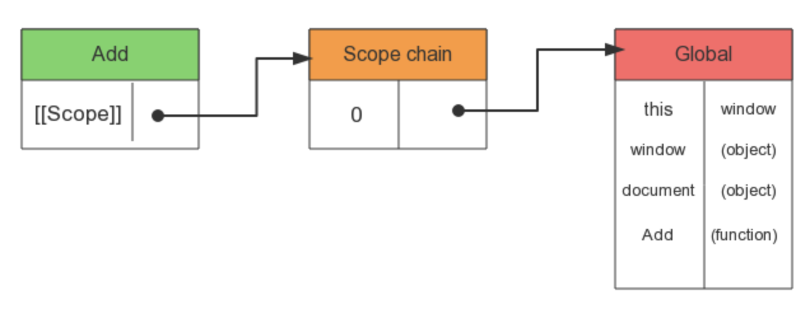
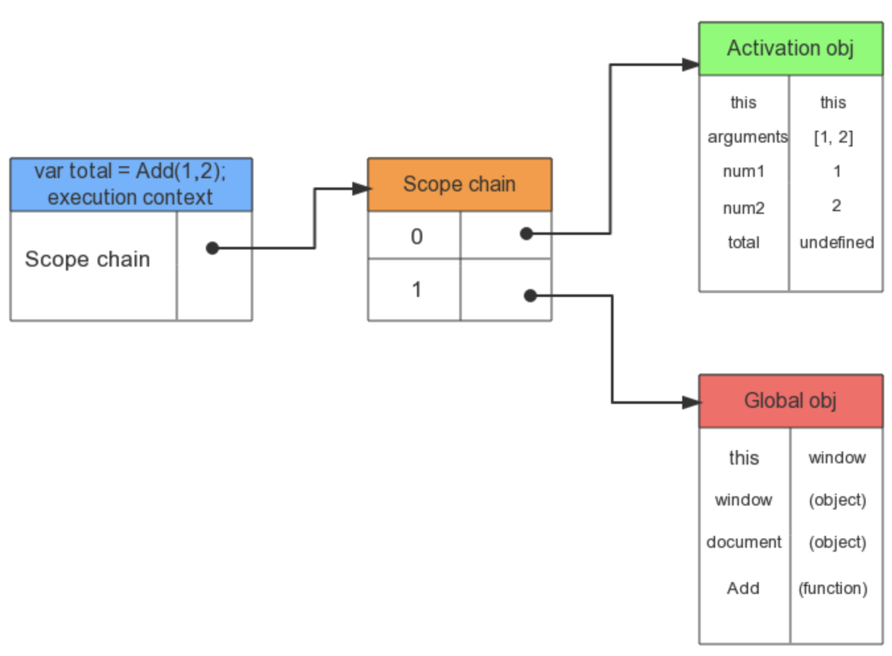
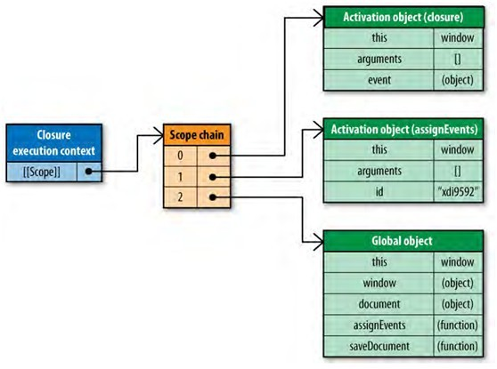

# CH 1 Loading and Execution
> 載入和埶行

## JS 的 block 特性

> JS 運行時其他的事情不能被瀏覽器處理。

大多數瀏覽器使用單進程處理 UI 更新和 JS 運行等多個任務，而同一時間只能有一個任務被執行。所以，JS 執行越久，網頁的響應時間越長。

## `<script>` 的位置

如果把 `<script>` 放在 `<head>` 中，頁面會等 JS 檔案全部下載並執行完成後才開始 render，在這些檔案下載和執行的過程中，會導致訪問網站的時候有明顯的延遲，容易遇到頁面打開時，先看到頁面是空白的。

推薦將所有的 `<script>` 標籤儘可能的放到，`<body>`標籤的底部(closing `</body>`的前面)，優先 render 頁面，減少頁面空白時間。

## 組合多個 `<script>`

每個 `<script>` 標籤初始下載的時候都會 block 頁面的 render，所以盡可能地減少內嵌的 `<script>`。另外，HTTP Request 會帶來額外的效能開銷，下載一個 100KB 的 JS 檔案比下載 4 個25kb 的 JS 檔案更快。

使用打包工具(ex. Gulp, Rollup, Webpack...等)以減少 request, 進行檔案合併壓缩，減少體積和文件數量，最小化延遲時間可以改善頁面的整體性能。

<!-- Yahoo! combo handler  -->

<!-- https://juejin.im/entry/5ae5c8c9f265da0b9f400d8e -->
<!-- https://www.zhihu.com/question/58081014 -->

## Non-blocking script 方法

### 1. `<script>` 的 defer and async 屬性 (HTML5)

> `<script defer="defer">`

`defer` 屬性: JS 檔案在頁面解析到 `<script>`的時候開始下載，但不會執行，頁面載入完成後才執行。`defer` 這個屬性僅適用於外部脚本(只有在使用 `src` 屬性時)。

> `<script async="async">`

`async` 屬性:一旦腳本可用，則會異步執行。`async` 屬性僅適用於外部腳本(只有在使用 `src` 屬性時)。

- 兩者的執行時機不同
- 如果 `async="async"`：腳本相對於頁面的其餘部分異步地執行(當頁面繼續進行解析時，腳本將被執行）
- 如果不使用 `async` 且用 `defer="defer"`：腳本將在頁面完成解析時執行
- 如果兩者都不使用：在 browser 繼續解析頁面之前，立即讀取並執行腳本

DOMContentLoaded and load 事件

HTML 文檔解析完成就會觸發 `DOMContentLoaded`，而所有資源加載完成之後，`load` 事件才會被觸發。

當前文檔中沒有 `script` 時，瀏覽器解析完文檔便能觸發 `DOMContentLoaded` 事件;如果文檔中包含 `script`，則 `script` 會阻塞文檔的解析，而 `script` 需要等 CSSOM 構建完成才能執行。在任何情況下，`DOMContentLoaded` 的觸發不需要等待圖片等其他資源加載完成。

<!-- 在jQuery 中經常使用的 $(document).ready(); 其實監聽的就是 DOMContentLoaded 事件，而$(document).load(); 監聽的是 load 事件。 -->

defer 與 DOMContentLoaded

如果腳本標籤中包含 `defer`，那麼這一塊腳本將不會影響 HTML 文檔的解析，而是等到 HTML 解析完成後才會執行。而 `DOMContentLoaded` 只有在 `defer` 腳本執行結束後才會被觸發。所以這意味著 DOM 文件解構不受影響，等 DOM 構建完成之後 `defer` 腳本執行，但腳本執行之前需要等待 CSSOM 構建完成。在 DOM，CSSOM 構建完畢，`defer` 腳本執行完成之後，DOMContentLoaded 事件觸發。

async 與 DOMContentLoaded

如果腳本標籤中包含 `async`，則 HTML 文檔構建不受影響，解析完畢後，DOMContentLoaded 觸發，而不需要等待 async 腳本執行，樣式表加載等等。

<!-- http://www.w3school.com.cn/html5/att_script_defer.asp -->
<!-- http://www.growingwiththeweb.com/2014/02/async-vs-defer-attributes.html -->
<!--
```
// (同步)整個網頁的繪製會停下，等 demo.js 下載完並執行完，網頁繪製才繼續。
<script src="demo.js" ></script>

// (Defer)網頁繪製不會停下， demo.js 在背景下載，待 DOMContentLoaded 再執行 demo.js。
<script src="demo.js" defer ></script>

// (Async)網頁繪製不會停下， demo.js 在背景下載。
<script src="demo.js" async ></script>
// 待 demo.js 下載完畢，網頁繪製停下，執行 demo.js。
// 待 demo.js 執行完畢，網頁繪製繼續。
```
-->
<!-- DOMContentLoaded https://zhuanlan.zhihu.com/p/25876048 -->
<!-- 在JS（不包括動態插入的 JS）執行完之後，才會觸發 DOMContentLoaded 事件。 -->
<!-- http://www.alloyteam.com/2014/03/effect-js-css-and-img-event-of-domcontentloaded/ -->

### 2. Dynamic Script Elements

JS 操作 DOM 建立 `<script>` 標籤，自定義生成標籤的 `type`、`src` 屬性。檔案會在該元素被新增到頁面的時候開始下載(如果檔案順序很重要的話，最好按照順序合成一個檔案)。無論何時啟動下載，檔案的下載和執行過程不會阻塞頁面的其他程序。

### 3. XHR Script Injectction

用 GET 請求一個檔案，收到有效的 response 後建立新的 `<script>`，最後新增進頁面。優點是下載後不會自動執行，缺點是檔案在請求頁面的同一個網域內，不能從 cdn 下載。

## 小結

- 將所有 `<script>` 標籤放在頁面的底部，`</body>` 的上方。此法可以保證頁面在腳本運行之前完成解析。
- 將腳本組合打包。頁面的 `<script>` 標籤越少，頁面的加載速度就越快，響應也更加迅速。不論外部腳本文件還是內聯代碼都是如此。
- 使用 non-blocking 方式下載 JS 檔案。
    - 使用 `script` 的 `defer` 和 `async` 屬性非同步下載。
    - 動態建立 `script` 標籤和執行程式碼。
    - XHR Script Injectction

---

# CH 2 Data Access
> 數據存取

## 四種基本資料存取位置
1. 字面量(literal value)：strings, numbers, booleans, objects, arrays, functions, regular expressions, null, undefined，字面量只代表自身，沒有儲存位置。
2. 變數(variables)：使用 `var`, `let` 宣告的變數。
3. 陣列元素(Array items)：具有數字索引(numerically indexed location)的 JS Array object。
4. 物件成員(Object members)：具有字符串索引(string-indexed location)的 JS object。

存取字面量和區域變數的速度是最快的，而陣列和物件相對較慢。

## Managing Scope 管理作用域

<!-- http://yolynn.com/page/2/ -->

1. Scope Chains and Identifier Resolution 作用域鏈和標識符解析

在 JS 中， function 是 object，一切都是 object，精確地說，function 是一個 Function 實例，它也和其它 object 一樣，擁有可以通過程式碼存取的屬性和一系列供 JS 引擎訪問的內部屬性。其中有個內部屬性 `[[Scope]]`，該屬性包含了 function 被創建的作用域中對象的集合，此集合被稱為函數的作用域鏈，它決定了哪些資料能被存取。

```
function add(num1, num2) {
    var sum = num1 + num2;
    return sum;
}
```
當 `add` 創建時，它的作用域會填入一個全局對象，其包含了所有的全局變數。



函數 `add` 的作用域將會在執行時用到：
```
var total = add(1, 2);
```



程式碼執行時會創建一個叫做"執行上下文環境(執行環境 / execution context)"的内部對象(internal object)，它定義了函數執行時的環境，每個 EC 都有自己的作用域鏈，用於標識符解析，當 EC 被創建時，它的作用域鏈初始化為當前運行函數的 `[[Scope]]` 所包含的對象。

裡面的這些值按照他們出現在函數中的順序被複製到該 EC 的作用域鏈中。它們共同组成了一個新的叫 `activation object` 的對象，其包含了函數的所有局部變數、命名參數、參數集合以及 `this`，然後此對象會被推入作用域鏈的前端，當 EC 被銷毀時，activation object 也會一同被銷毁。

在函數執行時，每遇到一個變數，都會經歷一次標識符解析過程以決定從哪裡獲取和儲存數據，這過程從從作用域鏈頭部，也就是從 `activation object` 開始找，查找同名的標識符，如果找到了就用對應的變數，如果没找到就繼續找作用域鏈中的下一對象，如果找完了還是沒找到，則認為未定義(undefined)。

全局變數總是處於 EC 作用域鏈的最後一個位置，所以總是最遠才能觸及到的。一個識別符號所在的位置越深，它的讀寫速度也就越慢。因此，函數中讀寫局部變數總是最快的，而讀寫全域變數通常是最慢的。

盡量使用局部變數儲存區域範圍外的變數，以減輕重複的全局變數訪問對性能的影響，比如：
```
function initUI() {
    var bd = document.body,
        links = document.getElementsByTagName_r("a"),
        i = 0,
        len = links.length;

    while (i < len) {
        update(links[i++]);
    }

    document.getElementById("go-btn").onclick = function() {
        start();
    };

    bd.className = "active";
}
```

此函數包含三個對 `document` 的引用，`document` 是一個全局對象。搜索這個變數必須遍歷整個作用域鏈，直到最後在全局變數對象中找到它。改寫為：
```
function initUI() {
    var doc = document,
        bd = doc.body,
        links = doc.getElementsByTagName_r("a"),
        i = 0,
        len = links.length;

    while(i < len) {
        update(links[i++]);
    }

    doc.getElementById("go-btn").onclick = function() {
        start();
    };

    bd.className = "active";
}
```

用 `doc` 這個局部變數來代替 `document` 的引用更快，如此訪問全局變數的次數是 1 次，而不是 3 次。

2. Scope Chain Augmentation 改變作用域鏈

一般來說，一個 EC 的作用域鏈不會被改變。但是有兩種表達式可以在執行時臨時改變 EC 作用域鏈。一個是 `with` 表達式，另一個是 `try catch` 的 `catch` 子句。(應該還有 `eval()`)

- `with` 表達式

<!-- https://developer.mozilla.org/zh-CN/docs/Web/JavaScript/Reference/Statements/with
http://luopq.com/2016/02/14/js-with-keyword/
-->
為了簡化多次編寫訪問同一對象的工作：
```
function initUI() {
    with (document) { //avoid reapting
        var bd = body,
            links = getElementsByTagName_r("a"),
            i = 0,
            len = links.length;

            while (i < len) {
                update(links[i++]);
            }

        getElementById("go-btn").onclick = function() {
            start();
        };

        bd.className = "active";
    }
}
```

> 因為 `with` 語意不明、難以閱讀，且可能是混淆錯誤和兼容性問题的根源，現在已不推薦使用 `with`，在 ECMAScript 5 嚴格模式中該標籤已被禁止。推薦的替代方案是聲明一個局部變量來承載你所需要的屬性。

- `try catch` 的 `catch` 子句

當錯誤發生時，程序流程自動轉入 `catch`，並將異常對象推入作用域鏈前端的一個可變對象中。在 `catch` 中，函數的所有局部變數現在被放在第二個作用域鏈對象中。只要 `catch` 子句執行完畢，作用域鏈就會返回到原來的狀態。
```
try {
    methodThatMightCauseAnError();
} catch (ex) {
    alert(ex.message); //scope chain is augmented here
}
```

透過最小化 `catch` 子句對性能的影響，常用的方式是將錯誤交给一個專用的函數來處理：
```
try {
    methodThatMightCauseAnError();
} catch (ex) {
    handleError(ex); // delegate to handler method
}
```

`handleError()` 函數是 `catch` 子句中唯一執行的程式碼。它以適當方法自由地處理錯誤，並接收由錯誤生的異常對象。這裡面只有一行語句，没有局部變數訪問，作用域鏈臨時改變就不會影響程式碼的性能。

<!-- 使用 `try catch` 語句時，確保你了解可能發生的錯誤。但它不應該作為你程式錯誤的解決辦法。如果知道一個錯誤會經常發生，那說明了應該修正程式碼本身的問题。 -->

3. Dynamic Scope 動態作用域

<!-- https://www.kancloud.cn/kancloud/you-dont-know-js-scope-closures/516614

https://www.kancloud.cn/kancloud/you-dont-know-js-scope-closures/516610

https://github.com/getify/You-Dont-Know-JS/blob/master/scope%20%26%20closures/ch2.md

https://github.com/getify/You-Dont-Know-JS/blob/master/scope%20%26%20closures/apA.md -->

`with` 表達式，`try-catch` 的 `catch` 子句，以及包含`()`的函數，都被認為是動態作用域。而動態作用域是在執行時被確定的，而不是在编寫時(静態地)查看程式碼結構來確定是否存在動態作用域。例如：
```
function foo() {
	console.log(a);
}

function bar() {
	var a = 3;
	foo();
}

var a = 2;

bar();  // 2
```

動態作用域(和 `this` (非使用 arrow function))本身不關心函數和作用域是在哪里及如何被聲明的，而是關心它們是從何處被調用的。事實上，JS 並沒有 dynamic scope，它只有詞法作用域(lexical scope)，但是 `this` 的機制有點像動態作用域。

JS 引擎在編譯階段期執行許多性能優化工作。其中的一些優化原理都歸结為實質上在進行詞法分析時可以靜態地分析程式碼，並提前決定所有的變數和函數聲明都在什麼位置，這樣在執行期間就可以少花些力氣來解析標識符。

但如果 JS 引擎在程式碼中發現一個 `eval(..)` 或 `with`，它實質上就不得不假定自己知道的所有的標識符的位置可能是無效的，因為它不可能在詞法分析時就知道你將會向 `eval(..)` 傳遞什麼樣的程式碼来修改詞法作用域，或者你可能會向 `with` 傳遞的對象有什麼樣的内容来創建一個新的將被查詢的詞法作用域。

換句話說，如果 `eval(..)` 或 `with` 出现，那麼它將做的幾乎所有的優化都會變得沒有意義，所以它就會簡單地根本不做任何優化。而你的程式碼幾乎肯定會趨於執行的更慢。因此推薦只在必要時才使用動態作用域。

4. Closures, Scope, and Memory 閉包，作用域和記憶體

> 閉包是函數可以記住並訪問其詞法範圍，即使它在詞法範圍之外被調用。

```
function assignEvents() {
    var id = "xdi9592";

    document.getElementById("save-btn").onclick = function(event) {
        saveDocument(id);
    };
}
```

閉包就是一個函數在 EC 期間被創建出來的函數，它允許函數訪問局部範圍之外的變數。
`assignEvents()` 為一個 DOM 元素指定了一個 event handler。這個 event handler 是一個閉包，它是當 `assignEvents()` 執行時被創建的，而且可以訪問其包含它範圍内的 id 變數。而為了使這個閉包能訪問到 id 這個變數，必須創建一個特定的作用域鏈。

當 `assignEvents()` 被執行時，一個 activation object 被創建，並包含了一些應有的內容，其中包括 id 變數。它將成為 EC 作用域鏈上的第一個對象，全局對象是第二個。當閉包創建時，`[[Scope]]` 屬性與這些對象一起被初始化。而閉包的作用域鏈也會引用 `assignEvent` 執行時候的activation object，這樣當 `assignEvents` 執行完的時候，雖然它本身 EC 的作用域鏈不再引用 activation object 了，但是閉包還是引用著 `assignEvents` EC 對應的 activation object。


`assignEvents` 函式執行完畢以後，`document.getElementById("save-btn").onclick` 引用了閉包，這樣當使用者點選`save-btn` 的時候，就會觸發閉包的執行，閉包執行和函數執行時的情形一樣，下圖描述上述 `onclick` 事件所關聯的閉包。



JS 引擎首先建立了閉包的 EC，然後用閉包作用域鏈來初始化閉包的 EC 作用域鏈，最後再將閉包執行時對應的 activation object 放入作用域的最前端(這也進一步驗證了閉包就是函式的論斷)。

閉包中使用的兩個標識符，`id` 和 `saveDocument`，存在於作用域鏈第一個對象之後的位置上，這是閉包最主要的性能關注點：你經常訪問一些範圍之外的標識符時，每次訪問都導致一些性能損失。因此，小心地使用閉包，記憶體和執行速度都值得被關注，但是，我們可以透過將常用的區域外變數存入局部變數中，然後直接訪問局部變數的方法，來減輕對執行速度的影響。

## Object Members

1. Prototypes and Prototype Chains

object 的命名成員包含了屬性(nonfunction)及方法(function)兩種。
```
function Book(title, publisher) {
    this.title = title;
    this.publisher = publisher;
}
Book.prototype.sayTitle = function() {
    console.log(this.title);
};

var book1 = new Book("High Performance JavaScript", "Yahoo! Press");
var book2 = new Book("JavaScript: The Good Parts", "Yahoo! Press");

console.log(book1 instanceof Book);  // true
console.log(book1 instanceof Object);  // true
book1.sayTitle();  // "High Performance JavaScript"
console.log(book1.toString());  // "[object Object]"
```

當 `book1.toString()` 被調用時，搜索工作必須深入原形鏈才能找到 `toString`。因此，屬性或方法在原型鏈中的位置越深，訪問它的速度也越慢。

2. Nested Members

`window.location.href` 這種寫法，每遇到一個點號，JS 引擎就要在對象成員上執行一次解析過程。所以，nested 越深，訪問速度越慢。 `location.href` 總是快於 `window.location.href`，而後者也要比 `window.location.href.toString()` 更快。如果這些屬性不是對象的實例屬性，那麼成員解析還要在每個點上搜索原形鏈，這將需要更長時間。

3. Caching Object Member Values

如果在同一個函數中要多次讀取同一個對象屬性，最好將它存入一個局部變數。以局部變數替代屬性，避免多餘的屬性查找帶來性能開銷。在處理 nested 的對象成員時這點特別重要，例如：
```
function hasEitherClass(element, className1, className2) {
    return element.className == className1 || element.className == className2;
}
```

`element.className` 被訪問了兩次。很明顯在這個函數過程中它的值是不會改變的，但仍然引起兩次對象成員搜索過程。可以將它的值存入一個局部變數，消除一次搜索過程，改寫成：
```
function hasEitherClass(element, className1, className2) {
    var currentClassName = element.className;
    return currentClassName == className1 || currentClassName == className2;
}
```

將常使用的對象成員、陣列和作用域外的變數存入局部變數中，訪問局部變數的速度會快於那些原始變數。

## 小結

- 資料的儲存位置對程式碼整體性能產生重要影響。四種資料型態:字面量(literal values)、變數(variables)、陣列(array)、對象(object)，其中以字面量和局部變數(local variables)訪問速度較快，array 和 object 則相對需要更長的時間。
- 盡量避免使用 `with` 表達式，另外也要小心處理 `try catch` 表達式的 `catch` 子句，因為它們會改變執行上下文(execution context)的作用域鏈。
- nested object members 容易造成較大的性能影響，應盡量少用。
- 一個屬性或方法在原形鏈中的位置越深，訪問它的速度就越慢。所以，將常使用的對象成員、陣列和作用域外的變數存入局部變數中。訪問局部變數的速度會快於那些原始變數。

---


<!-- http://jstherightway.org/zh-tw/ -->
<!-- https://blog.csdn.net/situdesign/article/details/5631527 -->
<!-- https://blog.csdn.net/situdesign/article/details/5631524 -->